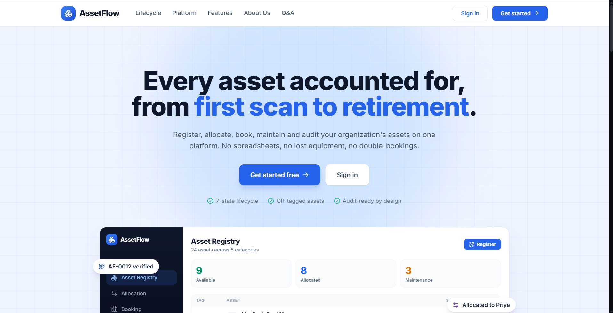
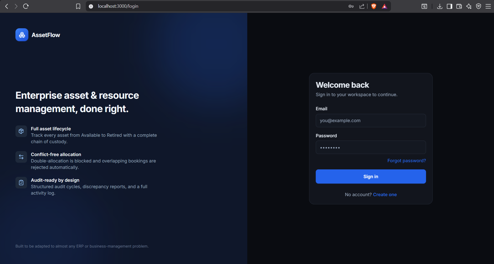
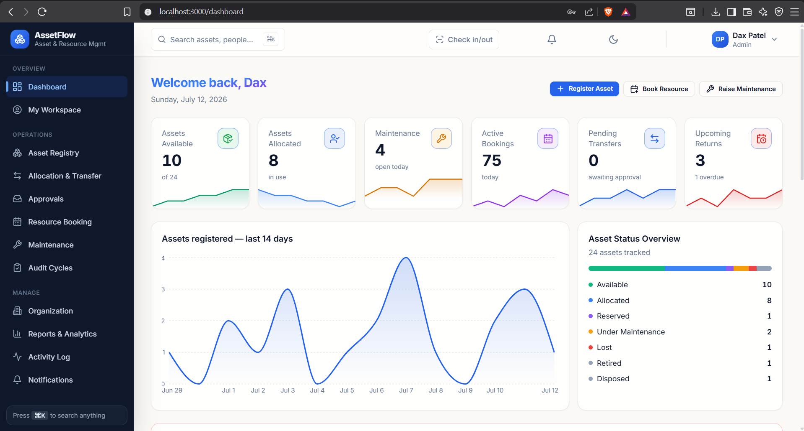
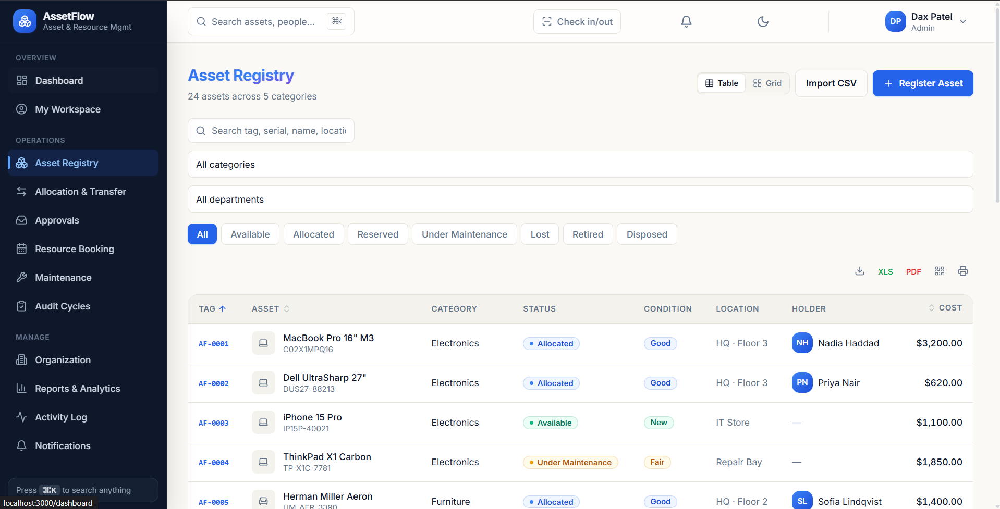
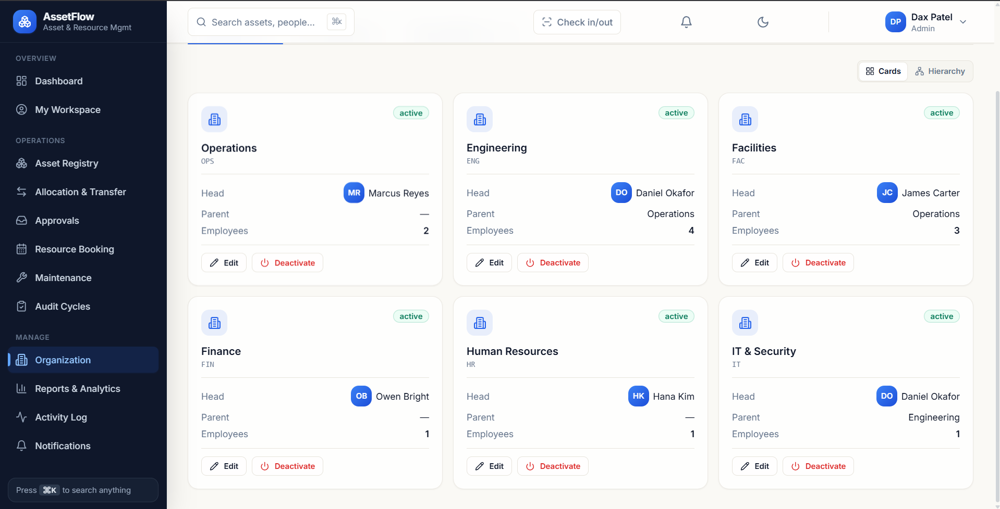
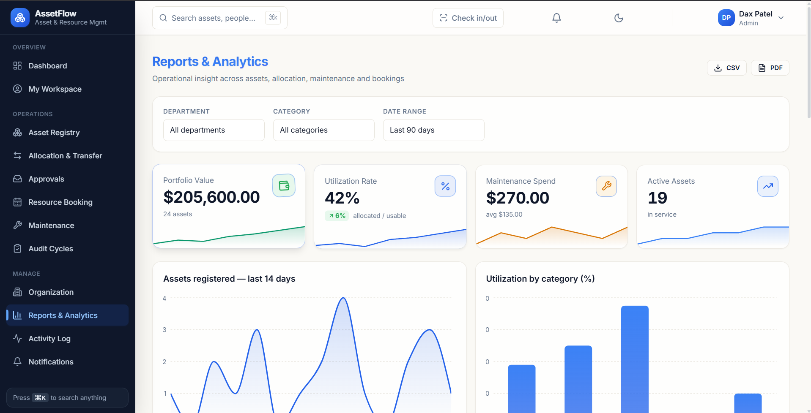
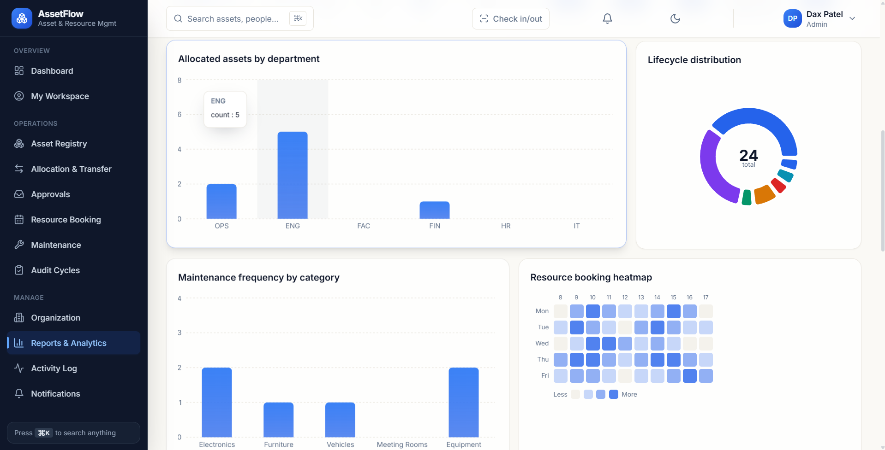

<p align="center">
  <h1 align="center">🏢 AssetFlow</h1>
  <p align="center">
    <strong>Enterprise Asset & Resource Management Platform</strong>
  </p>
  <p align="center">
    Full visibility into hardware inventory · resource bookings · maintenance lifecycles · compliance auditing
  </p>
  <p align="center">
    <a href="#-quick-start"><strong>Quick Start »</strong></a>&nbsp;&nbsp;
    <a href="#-features">Features</a>&nbsp;&nbsp;·&nbsp;&nbsp;
    <a href="#-architecture">Architecture</a>&nbsp;&nbsp;·&nbsp;&nbsp;
    <a href="#-api-reference">API</a>&nbsp;&nbsp;·&nbsp;&nbsp;
    <a href="#-demo">Demo</a>
  </p>
  <br/>
  <p align="center">
    
    
    
    
    
    
  </p>
</p>

---

## 📋 Table of Contents

- [Screenshots](#-screenshots)
- [Features](#-features)
- [Architecture](#-architecture)
- [Tech Stack](#-tech-stack)
- [Quick Start](#-quick-start)
- [Docker Deployment](#-docker-deployment)
- [Project Structure](#-project-structure)
- [API Reference](#-api-reference)
- [Database Schema](#-database-schema)
- [Testing](#-testing)
- [CI/CD](#-cicd)
- [Demo](#-demo)
- [Environment Variables](#-environment-variables)
- [Scripts Reference](#-scripts-reference)
- [Contributing](#-contributing)
- [License](#-license)

---

## 📸 Screenshots

A quick walkthrough of AssetFlow, from the public landing page through the admin workspace.

### Landing Page
<p align="center">
  
</p>

### Sign In
<p align="center">
  
</p>

### Dashboard
<p align="center">
  
</p>

### Asset Registry
<p align="center">
  
</p>

### Organization
<p align="center">
  
</p>

### Reports & Analytics
<p align="center">
  
</p>

<p align="center">
  
</p>

---

## ✨ Features

### 📦 Asset Registry
Track the full lifecycle of physical assets — laptops, vehicles, lab equipment, furniture — from acquisition through disposal. Every asset gets a unique tag (`AF-0001`), has category-specific custom fields, and maintains a complete audit trail.

### 📅 Resource Booking
Calendar-based reservation system for shared resources. Conflict detection ensures no double-bookings. Supports conference rooms, AV equipment, vehicles, and any bookable asset.

### 🔧 Maintenance & Repairs
Ticketing system for hardware issues with a full approval workflow:
`Reported → Approved → Assigned → In Progress → Resolved`

Track technician assignments, repair costs, priority escalation, and resolution notes.

### ✅ Compliance Auditing
Location-based audit cycles with integrated QR scanning. Run physical verification sweeps to identify missing, misplaced, or damaged assets across facilities.

### 🔄 Asset Transfers
Request and approve asset transfers between employees with a tracked approval chain and full reason/audit logging.

### 👥 Organization Management
Hierarchical department structure with department heads, role-based employee management, and category configuration with custom schema fields.

### 🔔 Real-time Notifications
Per-user notification system that fans out alerts for approvals, assignments, transfers, and maintenance updates.

### 📊 Reports & Analytics
Visual dashboards powered by Recharts with exportable reports in PDF (jsPDF) and Excel (ExcelJS) formats.

### 🔐 Role-Based Access Control (RBAC)
Four distinct roles with server-enforced permissions — not just hidden UI buttons:

| Role | Access Level |
|:-----|:-------------|
| **Admin** | Full platform access: org setup, all approvals, reports, user management |
| **Asset Manager** | Register/allocate assets, approve transfers & maintenance, run audits |
| **Dept Head** | Department-scoped view, approve department requests, manage bookings |
| **Employee** | Personal workspace: held assets, bookings, raise maintenance tickets |

---

## 🏗 Architecture

AssetFlow uses a **single-API-entrypoint** architecture for mutations, ensuring consistent RBAC enforcement and transactional integrity across all workflows.

```
┌─────────────────────────────────────────────────────────┐
│                     Client (Browser)                     │
│                                                         │
│  Zustand Store (useAF)  ←→  React Query  ←→  UI Pages  │
└────────────┬──────────────────────┬──────────────────────┘
             │                      │
        POST /api/actions     GET /api/bootstrap
        (single mutation)     (aggregate read)
             │                      │
┌────────────▼──────────────────────▼──────────────────────┐
│                    Next.js API Routes                     │
│                                                          │
│  ┌─────────────────────────────────────────────────────┐ │
│  │          assetflow-service.ts                       │ │
│  │  • Zod validation  • RBAC by session role           │ │
│  │  • $transaction    • Activity logging               │ │
│  │  • Notification fan-out                             │ │
│  └─────────────────────────────────────────────────────┘ │
└────────────────────────┬─────────────────────────────────┘
                         │
              ┌──────────▼──────────┐
              │   PostgreSQL 18     │
              │   (Prisma ORM)      │
              │   15 models · 12    │
              │   enums · indexed   │
              └─────────────────────┘
```

**Key design decisions:**
- **`GET /api/bootstrap`** — Single authenticated aggregate read returning all 11 collections in exact client shapes. `Cache-Control: no-store` ensures freshness after every write.
- **`POST /api/actions`** — Single mutation entrypoint with `{action, payload}` body. All lifecycle logic is Zod-validated, RBAC-gated by session role, and wrapped in Prisma `$transaction` for atomic multi-row operations.
- **JWT Authentication** — Stateless session management via `jose` with server-side middleware enforcement.

---

## 🛠 Tech Stack

| Layer | Technology | Purpose |
|:------|:-----------|:--------|
| **Framework** | [Next.js 15](https://nextjs.org/) | React framework with App Router & Server Components |
| **Language** | [TypeScript 5.7](https://www.typescriptlang.org/) | End-to-end type safety |
| **Styling** | [Tailwind CSS 3.4](https://tailwindcss.com/) | Utility-first responsive design |
| **State** | [Zustand](https://zustand-demo.pmnd.rs/) | Lightweight client-side state management |
| **Data Fetching** | [TanStack React Query](https://tanstack.com/query) | Server state synchronization & caching |
| **Animations** | [Framer Motion](https://www.framer.com/motion/) | Smooth UI transitions & micro-interactions |
| **ORM** | [Prisma 5](https://www.prisma.io/) | Type-safe database access with migrations |
| **Database** | [PostgreSQL 18](https://www.postgresql.org/) | Relational data with strict referential integrity |
| **Validation** | [Zod](https://zod.dev/) | Runtime schema validation for API payloads |
| **Auth** | [jose](https://github.com/panva/jose) + [bcryptjs](https://github.com/dcodeIO/bcrypt.js) | JWT tokens & password hashing |
| **Charts** | [Recharts](https://recharts.org/) | Interactive data visualization |
| **Exports** | [jsPDF](https://github.com/parallax/jsPDF) + [ExcelJS](https://github.com/exceljs/exceljs) | PDF & Excel report generation |
| **QR Codes** | [qrcode](https://github.com/soldair/node-qrcode) | Asset tag QR code generation for audits |
| **Icons** | [Lucide React](https://lucide.dev/) | Beautiful, consistent icon library |
| **Monitoring** | [Sentry](https://sentry.io/) | Error tracking & performance monitoring (optional) |
| **Testing** | [Vitest](https://vitest.dev/) + [Playwright](https://playwright.dev/) | Unit tests & E2E browser tests |
| **CI/CD** | [GitHub Actions](https://github.com/features/actions) | Automated typecheck, lint, test & build |

---

## 🚀 Quick Start

### Prerequisites

- **Node.js** v18+ ([download](https://nodejs.org/))
- **PostgreSQL** 14+ running locally ([download](https://www.postgresql.org/download/))

### Installation

```bash
# 1. Clone the repository
git clone https://github.com/daxpatel235/AssetFlow.git
cd AssetFlow/web

# 2. Install dependencies
npm install

# 3. Configure environment
cp .env.example .env
# Edit .env with your database credentials

# 4. Initialize database (create tables + seed demo data)
npm run db:setup

# 5. Start development server (with Turbopack)
npm run dev
```

Open **http://localhost:3000** — you're ready to go! 🎉

> **💡 Tip:** Use `npm run db:reset` to wipe and re-seed the database at any time for a clean demo state.

---

## 🐳 Docker Deployment

Run the entire stack with a single command — no local Postgres needed:

```bash
cd web

# Build and start PostgreSQL + Next.js
docker compose up --build

# In a separate terminal, seed demo data
docker compose exec web npm run db:seed
```

The app is available at **http://localhost:3000**.

<details>
<summary><strong>Docker Compose Services</strong></summary>

| Service | Image | Port |
|:--------|:------|:-----|
| `postgres` | `postgres:18-alpine` | `5432` |
| `web` | Custom (Dockerfile) | `3000` |

Data is persisted in a Docker volume (`pg_data`).

</details>

---

## 📁 Project Structure

```
AssetFlow/
├── .github/workflows/
│   └── ci.yml                  # GitHub Actions CI pipeline
├── web/
│   ├── prisma/
│   │   ├── schema.prisma       # Database schema (15 models, 12 enums)
│   │   └── seed.ts             # Demo data seeder
│   ├── src/
│   │   ├── app/
│   │   │   ├── (app)/          # Authenticated app routes
│   │   │   │   ├── dashboard/      # Overview & analytics
│   │   │   │   ├── assets/         # Asset registry CRUD
│   │   │   │   ├── allocations/    # Check-out / check-in
│   │   │   │   ├── bookings/       # Resource reservations
│   │   │   │   ├── maintenance/    # Repair tickets
│   │   │   │   ├── audits/         # Compliance audit cycles
│   │   │   │   ├── approvals/      # Pending approval queue
│   │   │   │   ├── reports/        # Export & analytics
│   │   │   │   ├── organization/   # Departments & categories
│   │   │   │   ├── my-workspace/   # Personal dashboard
│   │   │   │   ├── activity/       # Audit trail log
│   │   │   │   ├── notifications/  # User notifications
│   │   │   │   └── settings/       # App settings
│   │   │   ├── (auth)/         # Login / register / reset
│   │   │   ├── api/
│   │   │   │   ├── actions/        # POST — single mutation endpoint
│   │   │   │   ├── bootstrap/      # GET — aggregate state read
│   │   │   │   ├── auth/           # Login / register / session
│   │   │   │   ├── upload/         # File uploads
│   │   │   │   ├── notifications/  # Notification queries
│   │   │   │   ├── activity/       # Activity log queries
│   │   │   │   └── health/         # Health check endpoint
│   │   │   └── page.tsx        # Landing page
│   │   ├── components/
│   │   │   ├── assetflow/      # Domain-specific components
│   │   │   ├── layout/         # Shell, sidebar, navigation
│   │   │   └── ui/             # Reusable UI primitives
│   │   ├── lib/
│   │   │   ├── server/         # Server-only: service layer, RBAC
│   │   │   ├── store/          # Zustand store (useAF hook)
│   │   │   ├── schemas/        # Zod validation schemas
│   │   │   ├── mock/           # Client-side data shapes
│   │   │   ├── auth.ts         # JWT session utilities
│   │   │   ├── permissions.ts  # Role → permission mapping
│   │   │   ├── prisma.ts       # Prisma client singleton
│   │   │   ├── export.ts       # PDF / Excel export logic
│   │   │   ├── qr.ts           # QR code generation
│   │   │   └── ...             # Validation, formatting, etc.
│   │   ├── hooks/              # Custom React hooks
│   │   ├── providers/          # React context providers
│   │   ├── config/             # App configuration
│   │   ├── middleware.ts       # Auth middleware (route protection)
│   │   └── types.ts            # Shared TypeScript types
│   ├── tests/                  # E2E test suites (Playwright)
│   ├── docker-compose.yml
│   ├── Dockerfile
│   └── package.json
└── README.md
```

---

## 📡 API Reference

### Authentication

| Method | Endpoint | Description |
|:-------|:---------|:------------|
| `POST` | `/api/auth/login` | Authenticate & receive JWT session |
| `POST` | `/api/auth/register` | Create new user account |
| `POST` | `/api/auth/logout` | Clear session |
| `GET`  | `/api/auth/me` | Get current authenticated user |

### Core Endpoints

| Method | Endpoint | Description |
|:-------|:---------|:------------|
| `GET` | `/api/bootstrap` | Aggregate read — returns all 11 collections for the authenticated user |
| `POST` | `/api/actions` | Single mutation entrypoint — `{ action, payload }` |
| `GET` | `/api/health` | Health check |

### Available Actions (`POST /api/actions`)

<details>
<summary><strong>Asset Management</strong></summary>

- `registerAsset` — Register a new asset with category, department, and custom fields
- `allocate` — Allocate an asset to an employee
- `returnAllocation` — Return an allocated asset

</details>

<details>
<summary><strong>Transfers</strong></summary>

- `requestTransfer` — Request asset transfer between employees
- `decideTransfer` — Approve or reject a transfer request

</details>

<details>
<summary><strong>Bookings</strong></summary>

- `createBooking` — Reserve a bookable asset (with conflict detection)
- `cancelBooking` — Cancel an existing booking

</details>

<details>
<summary><strong>Maintenance</strong></summary>

- `raiseMaintenance` — Report a hardware issue
- `decideMaintenance` — Approve or reject a maintenance request
- `assignTechnician` — Assign a technician to an approved ticket
- `startMaintenance` — Mark repair work as in-progress
- `resolveMaintenance` — Close a resolved maintenance ticket

</details>

<details>
<summary><strong>Auditing</strong></summary>

- `createAuditCycle` — Create a new compliance audit cycle
- `setAuditResult` — Record scan result (verified/missing/damaged)
- `closeAudit` — Close an active audit cycle

</details>

<details>
<summary><strong>Organization</strong></summary>

- `addDepartment` / `updateDepartment` / `toggleDepartment`
- `addCategory` / `updateCategory`
- `addEmployee` / `setEmployeeRole` / `toggleEmployeeStatus`

</details>

<details>
<summary><strong>Notifications</strong></summary>

- `markRead` — Mark a single notification as read
- `markAllRead` — Mark all notifications as read

</details>

---

## 🗄 Database Schema

The PostgreSQL schema enforces strict referential integrity across **15 models** and **12 enums**:

```
Department ──┬── User (employees)
             ├── Asset
             └── Allocation

Category ────── Asset ──┬── Allocation
                        ├── Booking
                        ├── Transfer
                        ├── MaintenanceTicket
                        └── AuditResult

User ──┬── Allocation       AuditCycle ──── AuditResult
       ├── Booking
       ├── Transfer          ActivityLog
       ├── MaintenanceTicket Notification
       └── AuditResult
```

Key schema features:
- **Hierarchical departments** via self-referential relation
- **Custom category fields** stored as JSON schema
- **Composite indexes** for fast booking conflict detection (`assetId + startTime + endTime`)
- **Cascade deletes** for dependent records, `SetNull` for optional references
- **Decimal precision** for financial fields (`Decimal(12,2)`)

> Run `npm run db:studio` to explore the database visually with Prisma Studio.

---

## 🧪 Testing

```bash
# Unit tests (Vitest)
npm run test

# Unit tests in watch mode
npm run test:watch

# End-to-end browser tests (Playwright)
npm run test:e2e
```

The testing stack includes:
- **Vitest** — Fast unit testing with React Testing Library
- **Playwright** — Cross-browser E2E testing
- **jsdom** — DOM simulation for component tests

---

## ⚙ CI/CD

GitHub Actions runs on every push to `main`/`master` and on all pull requests:

```yaml
Pipeline: Install → Prisma Push → Typecheck → Lint → Test → Build
```

The CI environment spins up a PostgreSQL 18 service container, pushes the Prisma schema, and runs the full quality gate before allowing merges.

---

## 🎮 Demo

### Demo Credentials

| Role | Email | Password | What to explore |
|:-----|:------|:---------|:----------------|
| **Admin** | `pateldax23056@gmail.com` | `Dax...2323` | Full platform: org setup, approvals, reports, activity |
| **Asset Manager** | `marcus.reyes@assetflow.io` | `Owner@2026!` | Register/allocate assets, approve transfers & maintenance |
| **Dept Head** | `daniel.okafor@assetflow.io` | `Owner@2026!` | Department-scoped view, approvals, bookings |
| **Employee** | `priya.nair@assetflow.io` | `Owner@2026!` | Personal workspace, held assets, raise maintenance |
| **Technician** | `lena.fischer@assetflow.io` | `Owner@2026!` | Assigned repair tickets (start → resolve workflow) |

### Demo Walkthrough

1. **Login as Admin** — See the full dashboard with org-wide analytics
2. **Approve a maintenance request** — Watch the asset status flip to `Under Maintenance` everywhere
3. **Reload the page** — Data persists (full Postgres-backed, not mock data)
4. **Switch to Employee login** — Sidebar collapses to their access level; privileged API calls return `403`

### Seed Data Included

The demo seed (`npm run db:seed`) populates:
- 🏢 6 departments · 📂 5 asset categories · 👤 12 users
- 💻 24 assets · 📋 10 allocations · 📅 145 bookings
- 🔧 6 maintenance tickets (all statuses) · 🔄 4 transfers
- ✅ 3 audit cycles · 🔔 20 notifications · 📝 18 activity entries

---

## 🔑 Environment Variables

Create a `.env` file in the `web/` directory (see `.env.example`):

| Variable | Required | Description |
|:---------|:---------|:------------|
| `DATABASE_URL` | ✅ | PostgreSQL connection string |
| `JWT_SECRET` | ✅ | Secret key for JWT signing (min 16 chars) |
| `APP_URL` | ❌ | Base URL for password reset links (defaults to request origin) |
| `SMTP_HOST` | ❌ | SMTP server for email notifications |
| `SMTP_PORT` | ❌ | SMTP port (default: `587`) |
| `SMTP_USER` | ❌ | SMTP authentication username |
| `SMTP_PASS` | ❌ | SMTP authentication password |
| `MAIL_FROM` | ❌ | Sender address for emails |
| `NEXT_PUBLIC_SENTRY_DSN` | ❌ | Sentry DSN for error monitoring |

> **Note:** Without SMTP configuration, password reset links are printed to the server console. Without Sentry DSN, the app runs fully offline with no cloud dependencies.

---

## 📜 Scripts Reference

All scripts are run from the `web/` directory:

| Script | Command | Description |
|:-------|:--------|:------------|
| **Dev Server** | `npm run dev` | Start dev server with Turbopack |
| **Build** | `npm run build` | Production build |
| **Start** | `npm start` | Start production server |
| **Typecheck** | `npm run typecheck` | TypeScript type checking |
| **Lint** | `npm run lint` | ESLint code analysis |
| **Format** | `npm run format` | Prettier code formatting |
| **DB Push** | `npm run db:push` | Push Prisma schema to database |
| **DB Migrate** | `npm run db:migrate` | Run Prisma migrations |
| **DB Seed** | `npm run db:seed` | Seed database with demo data |
| **DB Setup** | `npm run db:setup` | Push schema + seed (fresh install) |
| **DB Reset** | `npm run db:reset` | Force reset + re-seed (destructive) |
| **DB Studio** | `npm run db:studio` | Open Prisma Studio GUI |
| **Generate** | `npm run generate` | Scaffold a new module |
| **Test** | `npm run test` | Run unit tests (Vitest) |
| **Test Watch** | `npm run test:watch` | Run tests in watch mode |
| **Test E2E** | `npm run test:e2e` | Run E2E tests (Playwright) |

---

## 🤝 Contributing

1. **Fork** the repository
2. **Create** a feature branch (`git checkout -b feature/amazing-feature`)
3. **Commit** your changes (`git commit -m 'Add amazing feature'`)
4. **Push** to the branch (`git push origin feature/amazing-feature`)
5. **Open** a Pull Request

Please ensure your PR passes the CI pipeline (typecheck + lint + tests + build).

---

## 📄 License

This project is private and proprietary.

---

<p align="center">
  Built with ❤️ by <a href="https://github.com/daxpatel235">Dax Patel</a>
</p>
