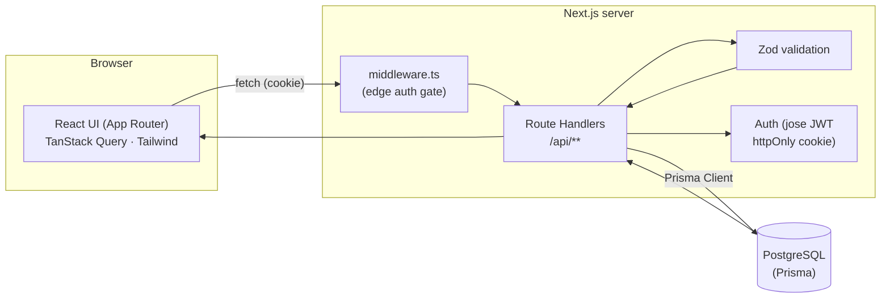
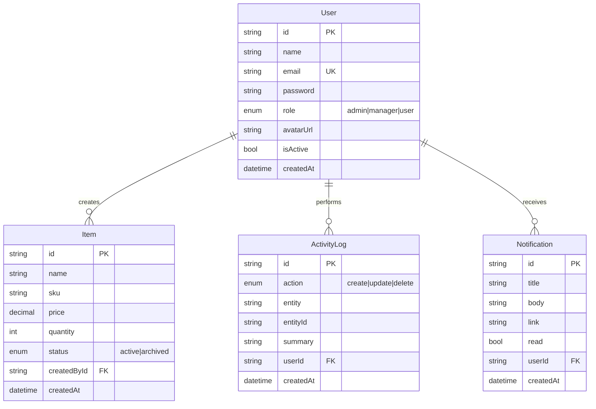

# System Design

Submission-ready architecture + data model for the app. The ER diagram and
flow render automatically on GitHub (Mermaid).

## 1. High-level architecture
One **Next.js 15 full-stack app** — the UI and the API live in the same
codebase, talking to **PostgreSQL** through **Prisma**.

## 2. Request lifecycle
1. UI calls `/api/...` via `lib/api-client` (the httpOnly session cookie rides along automatically).
2. `middleware.ts` verifies the cookie at the edge and gates protected pages.
3. The route handler validates the body/query with a **Zod** schema, checks the session
   (`requireUser` / `requireRole`), runs the **Prisma** query, and writes an **audit log**.
4. TanStack Query caches the result and re-fetches after mutations.

## 3. Data model (ERD)

> `Item` is the example entity. Real modules are added with `npm run generate`,
> which appends a model + relation here and regenerates the client.

## 4. Design decisions (talking points for judges)
- **PostgreSQL + Prisma** — relational integrity + transactions suit business data
  (users → records → audit); Prisma gives type-safe queries and easy migrations.
- **Data integrity** — money is `Decimal(12,2)`, never float, so sums never drift by a
  cent; every model is indexed on its owner (+ status) and each foreign-key column, so
  list/filter scans ride a B-tree; `onDelete` cascades keep the graph consistent. The
  module generator emits all of this automatically, so new entities are strong by default.
- **httpOnly-cookie auth (jose JWT)** — the token is never exposed to client JS, so it
  can't be stolen via XSS (unlike a `localStorage` token). Middleware verifies it at the edge.
- **Zod** — one schema validates the API input *and* types the client. Bad input returns
  a clean `400` with per-field errors.
- **Owner scoping** — every record query is filtered by `createdById`, so users only see
  their own data; another user's id simply `404`s.
- **Audit log + notifications** — every write is recorded; the bell surfaces user events.
- **Semantic-token theming** — one set of CSS variables drives light/dark mode app-wide.

## 5. Security
JWT in httpOnly + SameSite cookie · bcrypt password hashing · rate-limited auth ·
server-side authorization on every route · input validation on every write ·
Sentry error monitoring.
